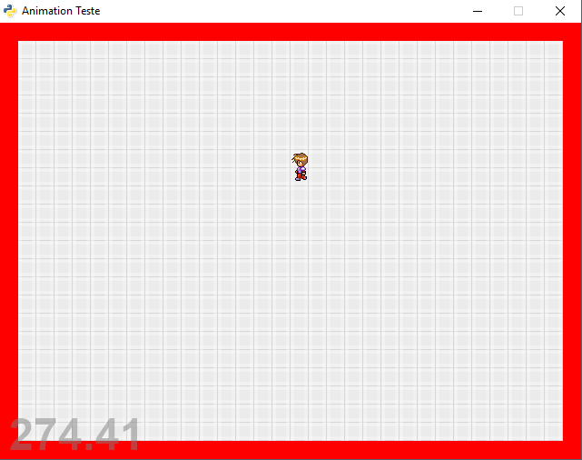

# Sprite animation in Pyglet

Video preview: https://youtu.be/SRQIoy-nkW8



I made this when I was studying Pyglet long ago: it is a simple sprite animation and movement test, a draft for a 2D game. Use the keyboard arrows (up, right, down, left) to control the guy on screen and make him walk in different directions. It animates from different sprite in a sheet I download from somewhere (I only made the background sprite, the other sprites credits go to the their creator, no idea who he his but good job).

Don't expect fancy stuff, this was made long ago just for test, no game objetivs built in and will never finish it. This is a students draft made long ago: the code could be optimized (too many lines and if's). But it served it's purpose at the time. 

Everyone can use this in any way they like, I don't care about licenses or copyright, just have fun.

##How to run:
If you don't have Python installed simply run the file "main.exe" - I compiled it from the Python source with Pyinstaller: "pyinstaller.exe --onefile --windowed main.py"
Note: I have not tested it in the .exe format.

To run the source code like a boss the only requirement is:
To use this the only requirement is:
-An installed version of Python 2.7 (not tested with other versions)
-Pyglet (used 1.2.4)

To get pyglet just do in the comand line:
```pip install pyglet
```

Then just run the file "main.py". Arrow keys to control the movement.

##Contacts:
My Homepage: [www.paulojorgepm.net](http://www.paulojorgepm.net)

Have fun

PS: If you don't know it, Pyglet is a great OpenGL Python library for multimedia, 2D, GUI, (etc.) stuff. It is like Pygame on steroids and more "pythonic". Website: 
[https://bitbucket.org/pyglet/pyglet/wiki/Home](https://bitbucket.org/pyglet/pyglet/wiki/Home)
